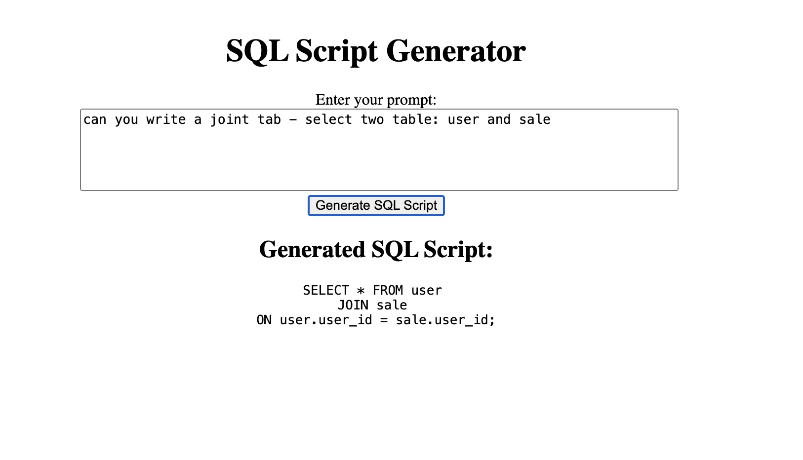

# OpenAI SQL Generator

This project is a web application that allows users to input a prompt (such as a request for a SQL script), sends that prompt to the OpenAI API, and returns the generated SQL script to display on the frontend.




## Project Structure

- **Backend**: The backend is located in the `openai-sql-app` folder. It is a Node.js application using Express to create a simple API endpoint that communicates with the OpenAI API.
- **Frontend**: The frontend is located in the `sqlScriptGenerator` folder. It is an Angular application that provides a user interface for inputting prompts and displaying the generated SQL scripts.

## Installation

### Backend

1. Navigate to the `openai-sql-app` directory:
    ```sh
    cd openai-sql-app
    ```

2. Install the dependencies:
    ```sh
    npm install
    ```

3. Create a [.env](http://_vscodecontentref_/1) file in the [openai-sql-app](http://_vscodecontentref_/2) directory and add your OpenAI API key:
    ```properties
    OPENAI_API_KEY=your_openai_api_key_here
    ```

4. Start the backend server:
    ```sh
    node server.js
    ```

### Frontend

1. Navigate to the [sqlScriptGenerator](http://_vscodecontentref_/3) directory:
    ```sh
    cd sqlScriptGenerator
    ```

2. Install the dependencies:
    ```sh
    npm install
    ```

3. Start the Angular development server:
    ```sh
    ng serve
    ```

## Usage

1. Ensure the backend server is running on `http://localhost:3000`.
2. Open your browser and navigate to `http://localhost:4200`.
3. Enter a prompt in the text area (e.g., "Create a table named employees with columns id, name, and position.").
4. Click the "Generate SQL" button.
5. The generated SQL script will be displayed below the button.

## Summary

- **Backend**: A Node.js server using Express that exposes a `/generate-sql` endpoint. It uses the OpenAI API to generate SQL based on user prompts.
- **Frontend**: An Angular application with a service (`OpenaiSqlService`) to call the backend. A component (`AppComponent`) collects user input, calls the service, and displays the generated SQL script.